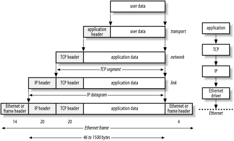

##EEE330 Assignment 2: Understanding the TCP/IP Stack

-Reference: Matthews, Jenna. Computer Networking. John Wiley & Sons, Inc, 2000. 

For this assignment you will use the following PCAP: [simpleHttp.pcap](./simpleHttp.pcap).

- [TCP/IP Cheat Sheet](./TCP-IP-tcpdump_PocketReference_SANS.pdf)

You will now use Wireshark to inspect the packet capture and examine the data. Wireshark is a free open source tool for inspecting and analyzing network traffic. You should read Chapter 4 of Practical Packet analysis to help in your usage of the tool. Using the Wireshark tool and the packet capture provided answer the following questions. The following questions are focused on exploring the TCP/IP network stack and highlighting the separation of each layer. Lecture slides and the TCP/IP Cheat sheet provided in class may be helpful in answering the questions.

1. Name and briefly describe the 7 layers of the OSI model.
`See slide 12 in the protocol stack lecture`

2. What is the IP address of the PC and the Router?
```PC: 192.168.0.101
Router: 192.168.0.1```

3. What are the MAC address of the PC and the Router?
```PC: 00:07:e9:53:87:d9
Router: 00:06:25:8d:be:1d```

4. Examine packet 4. What is the size of the following? Provide an illustration of how the packet is layered and label each of these elements.
	- a. The Ethernet Header.
	`14 bytes`
	- b. The Ethernet Frame.
	`481 bytes`
	- c. The IP Header.
	`20 bytes`
	- d. The IP Datagram.
	`467 bytes`
	- e. The TCP Header.
	`20 bytes`
	- d. The TDP data segment.
	`447 bytes`

	

5. When using tcpdump to capture network traffic there is a snap length option that will limit the size of the packet to capture. The default option is to capture the packet in its entirety. If you wanted to limit the amount of data to capture to only capture the headers for the Ethernet, IP, and TCP layers what would you need to set the snap length to.

`Setting the packet to 54 bytes will capture just the header information in most cases. However, if the IP or TCP field have options you will loose some data from the hears.`

6. What is the largest possible IP packet? How did you figure this out?

`Longest IP packet is 65,535 bytes. This is based on the IP length field being 16 bits long. 2^16 is the largest value -1 for the 0 sized packet.`
